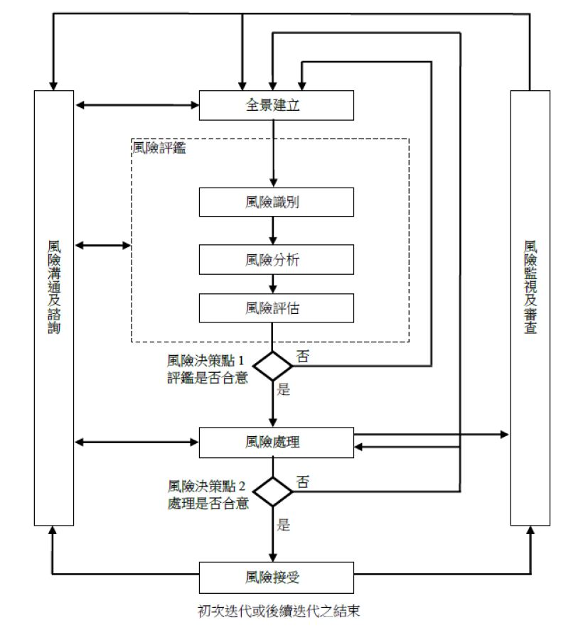

# 風險管理(Risk Management)  

### 參考資料
- [NIST Risk Management Framework RMF](https://csrc.nist.gov/Projects/risk-management)
- [ISO/IEC 27005:2022 Information security, cybersecurity and privacy protection — Guidance on managing information security risks](https://www.iso.org/standard/80585.html)

### 風險(Risk)
- 風險(Risk)
  - ISO 31000:2018定義==> 對於組織目標之不確定影響(effect of uncertainty on objectives)
    - 影響 ==> 對於預期結果的誤差，包括正向與負向的結果
    - 組織==> 適用於各種類型與大小之公務與非公務機關。
    - 組織目標==> 可包含不同面向，如財務、健康、安全及環保等目標，可應用於不同階層，上至組織策略、專案工作，下至產品發展與過程或資安等
  - 風險通常會參考潛在之事件及其可能造成之後果加以描繪與表示，包含事件發生的改變程度與發生的可能性等。
  - 風險意指任何類型與大小的組織，為達成組織的目標，所面對內部及外部因素影響的不確定性，包含事件發生的改變程度與發生的可能性等。
- 風險管理
  - 協同所有之活動加以指導，並控制組織所關注之風險。
- 風險管理目的:創造與保護資產的價值(ISO 31000)
- 風險管理原則(ISO 31000)
  - 原則1：框架與過程應該客製化且互相對應。
  - 原則2：利害關係人必須適當與及時的參與。
  - 原則3：採用結構與全面的方法。
  - 原則4：風險管理是組織所有活動的一部分。
  - 原則5：風險管理應依預測、發現、告知及反應而執行變更。
  - 原則6：風險管理應考慮可用資訊的限制。
  - 原則7：風險管理的各個面向都會受到人文因素影響。
  - 原則8：風險管理透過學習與經驗不斷改進。
  - 前5項原則為設計風險管理措施提供指導
  - 原則6、7及8則是與風險管理運作有關措施。
  - PACED:
    - 前5項原則涉及風險管理措施的設計與規劃，且這些原則經常被歸納為比例性(proportionate)、一致性(aligned)、全面性(comprehensive)、嵌入性(embedded)及動態性(dynamic)，簡稱PACED
- 風險管理之框架
  - 風險管理框架的目的是協助將風險管理納入所有活動與功能
  - 風險管理的有效性取決於整合到治理與組織的所有其他活動中

### 風險管理 過程|流程

- 風險溝通與諮詢階段 
  - 在風險管理初期階段，便應發展溝通與諮詢方法，俾利風險管理過程中各階段，向機關外部與內部之利害關係人溝通與諮詢。
  - 風險溝通是決策者與其他利害關係人藉由交換或分享風險資訊，於風險管理上達成協議的活動，其所獲得之資訊包含(但不限於)風險之存在、本質、形式、發生可能性、衝擊嚴重程度、處理之方法及風險可接受之程度等。
  - 機關應納編各部門成員及各領域專家，組成完整之溝通與諮詢團隊，並提供協助 
- 建立全景階段 
  - 風險評估準則(Risk Evaluation Criteria) == > 決定風險處理之優先順序
  - 衝擊準則(Impact Criteria) 
  - 風險接受準則(Risk Acceptance Criteria) == > 決定風險處理範圍
- 風險評鑑階段 
  - 風險評鑑方法: 
    - 族繁不及備載 ==> 腦力激盪 | 結構或非結構化面談 | 德爾菲(Delphi) | 查檢表 | ......
    - CNS/ISO/IEC 27005:2011建議之資安風險評鑑方法：
      - 高階風險評鑑法== >企業衝擊分析
        - 優點：
          - 一開始採用較簡單之作法，容易獲得風險評鑑參與人員之接受。
          - 可做為良好之輔助規劃，以建構機關資安之策略藍圖。
          - 可將資源及預算運用於最有利之處。
        - 缺點：
          - 由於初始採用高階風險評鑑，潛在地存在評鑑結果較不精確，可能未識別某些營運過程或系統，可視需要針對高安全等級之資產，進行詳細風險評鑑作業。 
      - 詳細風險評鑑法== >後果/機率矩陣(Consequence/probability matrix) ==> 進階課程主題
  - 風險評鑑流程
    - 風險識別
      - 1.資產識別
      - 2.威脅與脆弱性識別
      - 3.現有控制措施識別
      - 4.後果識別 ==> 識別資產上可能喪失機密性、完整性及可用性之後果
    - 風險分析(含衝擊後果、發生可能性、風險等級)
      - 5.後果評鑑(亦可視為：資訊及資通系統資產價值) 
      - 6.事件可能性評鑑
      - 7,決定風險等級
        - 計算風險值
          - 資產風險值＝(資產價值) × 威脅發生可能性 × 脆弱性利用難易度  
    - 風險評估 
      - 8.決定「風險可接受水準」 
- 風險處理(risk treatment)階段 
  - 依風險評鑑結果及實作風險處理方案之預期成本及預期利益等，選擇適當之行動方案，以使風險之不利後果，合理的降低。
  - 四大風險處理方案(risk treatment options)
    - 風險修改(風險降低)
    - 風險保留
    - 風險避免
    - 風險分擔 
- 風險監視與審查階段
  - 風險因素之監視與審查
  - 內部稽核
    - 為確保安控措施實施之有效性，定期檢視是必要的，建議每年執行2次內部稽核
    - 每次稽核分為5個階段，依序為「準備」、「開始會議」、「稽核審查」、「結束會議」及「稽核報告」 
  - 外部稽核 ==> 透過獨立第三方執行外部稽核
  - 矯正預防階段 ==> 依據「內部稽核」與「外部稽核」結果，加以「持續改進

### ISO 27005 規範的風險處理(risk treatment)階段流程
- 1.選擇合適的資訊安全風險處理方案
  - 參看 8.2 Selecting appropriate information security risk treatment options 
- 2 確定實施資訊安全風險處理方案所必需的所有控制措施
  - 參看 8.3 Determining all controls that are necessary to implement the information security  risk treatment options
- 3.將確定的控制與 ISO/IEC 27001:2022 附錄 A 中的控制進行比較
  - 8.4 Comparing the controls determined with those in ISO/IEC 27001:2022, Annex A
- 4.產出 `適用性聲明(SOA, Statement of Applicability)`
  - 8.5 Producing a Statement of Applicability
- 5.完成 `資訊安全風險處理計劃`  參看8.6 Information security risk treatment plan
  - 風險處理計劃的製定   參看8.6.1 Formulation of the risk treatment plan
  - 風險負責人(risk owners)的批准    參看 8.6.2 Approval by risk owners
  - 剩餘資訊安全風險的驗收  參看  8.6.3 Acceptance of the residual information security risks
